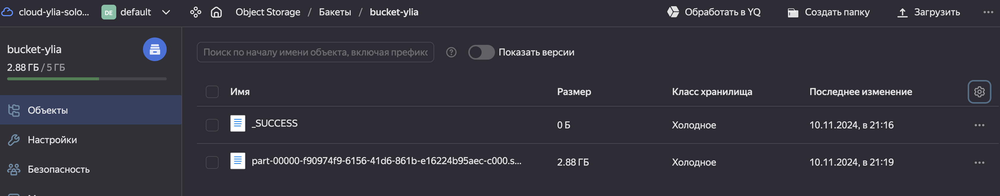

# Миниотчет:

## 1. Создание аккаунта в Yandex Cloud
- Создан сервисный аккаунт для работы с кластером Data Proc, предоставлены роли.

## 2. Создание bucket в Yandex Cloud 
- Создан bucket для хранения данных.
- Bucket сделан общедоступным для чтения. 
- Точка доступа к bucket указана в README-файле репозитория.

## 3. Создание Spark-кластера в Data Proc
- Создан Spark-кластер с указанным bucket.
- Настроены два подкластера:
  - **Мастер-подкластер**:
    - Класс: `s3-c2-m8`
    - Размер: 40 ГБ
  - **Compute-подкластер**:
    - Класс: `s3-c4-m16`
    - размер : 128 ГБ
- Настроен публичный доступ к мастер-узлу с созданием группы безопасности:
  - Входящие TCP-соединения на порт 22 для SSH.
  - Входящие TCP-соединения на порт 8888 для Jupyter Notebook.
  - Исходящие TCP-соединения со всех портов мастер-узла.

## 4. Анализ датасета мошеннических транзакций
- Выявлены основные проблемы с данными:
  - Неполные записи
  - Неверные значения в колонках
  - Дубли

## 5. Создание скрипта для очистки данных
- Разработан скрипт на Spark для очистки данных.

## 6. Выполнение очистки датасета
- Датасет очищен с использованием созданного скрипта.
- Очищенные данные сохранены в формате Parquet в созданном bucket.

---

