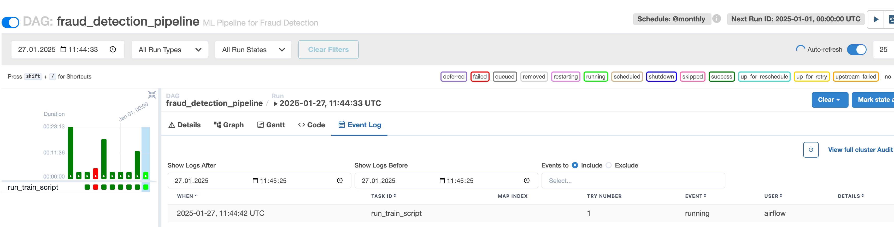
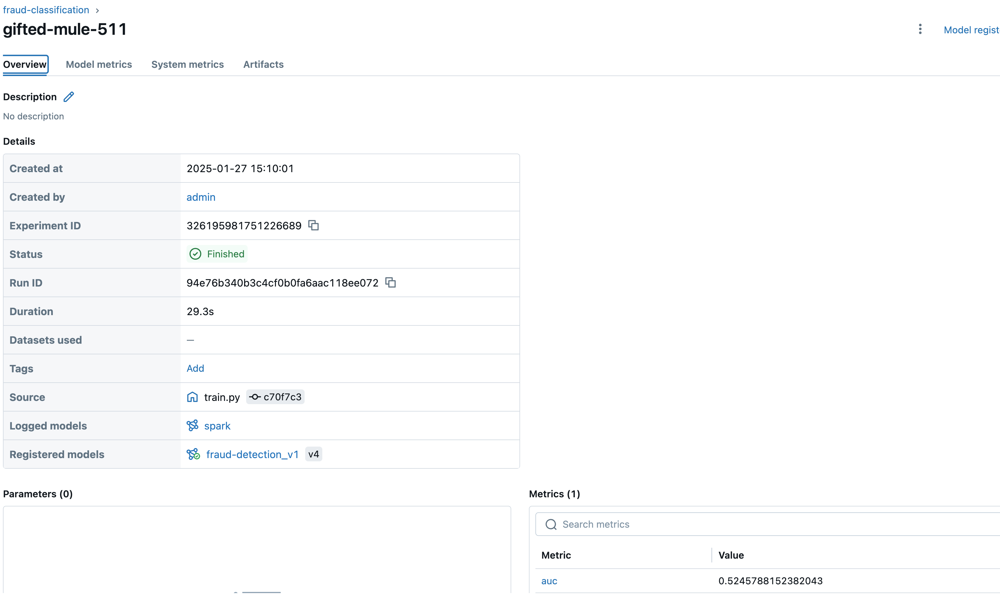
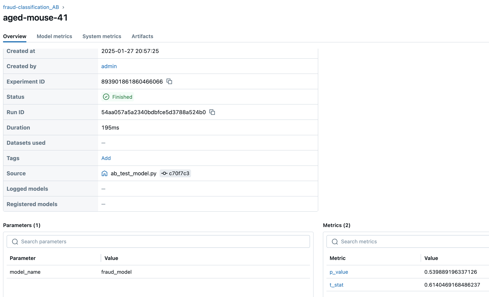
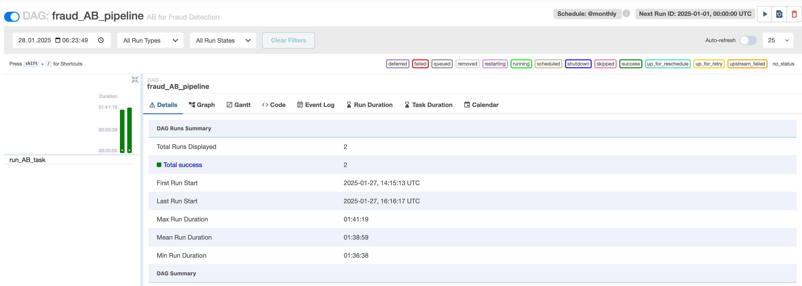

# A/B Test для Fraud Detection

## Описание
Даг `dags/ab_test.py` выполняет A/B тестирование модели для задачи fraud detection с использованием левостороннего t-теста на бутстрап-выборке. 

## Этапы:

### 1. Генерация бутстрап-выборок
Для оценки модели генерируются бутстрап-выборки из тестовых данных (можно взять продовые (например последние) данные)

### 2. Оценка метрик
Модель применяется к каждому подмножеству данных, и для каждой выборки рассчитывается AUC.

### 3. A/B
Сравниваются метрики для двух групп (Для определения, есть ли статистически значимая разница в производительности модели между матожиданиями метрик, используется t-тест. 

- Если p-значение больше установленного порога (например, 0.05), разница между группами считается незначимой.
- Если p-значение меньше порога, разница считается статистически значимой.

### 4. Логирование результатов в MLflow

## Логируемые данные
- **Параметры теста**: параметры, используемые для теста
- **Результаты A/B теста**: t-статистика и p-значение для сравнения метрик.
- **Метрики для групп A и B**: значения AUC для каждой группы.

---------

### 1) Тренировка модели `dags/train_model.py`: 

Эндпоинт и путь к данным указан в файле `.env`

### 2) A/B тестирование модели `dags/ab_test.py`

## Вывод: на основании t-test

- **p-value = 0.53**: Мы не можем утверждать, что метрика в группе A статистически значимо лучше, чем в группе B, по метрике ROC-AUC на бутстреп-выборке.

- **AUC для группы A = 0.5221** и **AUC для группы B = 0.5220**: Разница между значениями минимальна. 

